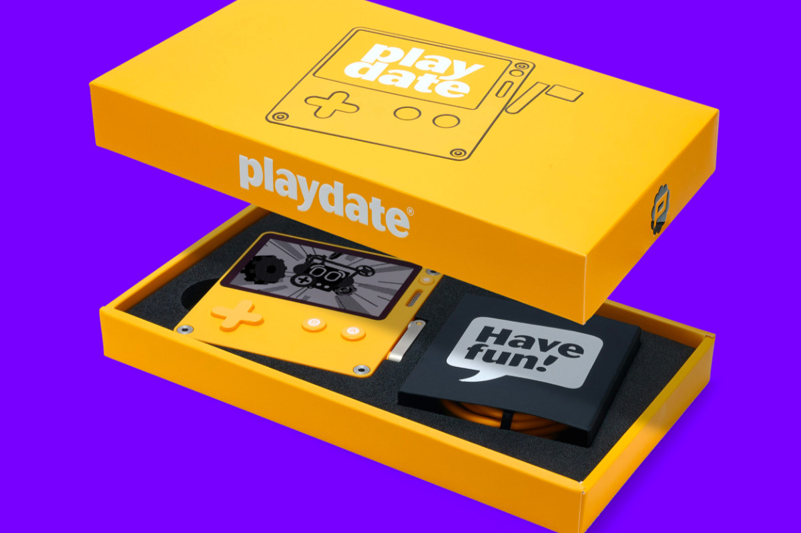

I finally got my [Playdate](https://play.date)! I had placed my preorder within less than a minute of them opening up orders, and while it was supposed to ship last December, things happened and it was delayed a bit. They started shipping last week though, and I have mine now! Thanks, Panic ❤️

I *love* the aesthetic of this thing. It's tiny, bright yellow, has a purple cover accessory, and is just the cutest thing ever. I'm definitely getting a [Stereo Dock](https://play.date/#playdate-stereo-dock) when it's available, but there's no date or anything for that yet.

The form factor is a little rough to play on. The display is tiny and doesn't have a backlight, and the crank requires more force than I was expecting which can be tricky for some games that require quick or precise movement. Overall though it's a fun toy that I'd recommend to anyone

Let's get to the real fun though.

## The Games

New Playdate owners get a collection of games included with the purchase, rolling out with two games a week, known as Season One. I'll be updating this with reviews of any of the games that stand out to me throughout the season. You can also easily sideload games or make them yourself!

Overall I've found the Season One games to be fine but not anything I've immediately loved. They're *unique*, but not especially fun or engaging. That said there are 24 games rolling out in the coming weeks and I've only tried the first few so far, so I'm sure there are some that I'll love.

### [Bloom](https://rngpartygames.itch.io/bloom)

My favorite game on Playdate so far isn't part of the Season One package, but is instead sold independently on itch.io. I love casual games around playing for a few minutes here and there, which the Playdate seems perfect for, and I also love simple narrative-driven games like visual novels. Bloom combines those elements excellently, with a relaxed, cozy gameplay around running a flower shop and talking with friends. This game is wonderful and I love it.

### [Casual Birder](https://play.date/games/casual-birder/)

One of the early Season One games, Casual Birder is an interesting one. You play as someone in a small town, tasked with taking photos of birds. Use the crank to focus your camera. I like a lot of things about it, but the overall gameplay feels clunky, and generally off in a way that's hard to describe. I like a lot of the writing and visual design, but it feels like an idea that needed a bit more polish to really be fun and engaging.

## The SDK

As a software developer, the thing that made me most excited for Playdate was the idea of making my own stuff for it. I'm not exactly a competent dev when it comes to making games, but I loved the idea of a very simplified form factor that limited the scope of a potential game to something more manageable.

The [Playdate SDK](https://play.date/dev) is really, really good. It has solid documentation, a great selection of example projects, and is incredibly approachable. I've done a bit of work in lower level game dev stuff in the past, but Panic has done an excellent job of making input handling, file IO, audio playback, sprite rendering, and a lot more quite painless.

I started off by digging through their example projects, as I always find it way easier to learn something in development by seeing actual implementations of something rather than a list of available functions without any real context. I [got rickrolled](https://twitter.com/alanaktion/status/1499102415143927809), learned how text and sprite rendering worked, and started on the easiest type of game I could build: a visual novel.

If you're building a visual novel for PC or mobile, you should basically only ever choose one engine: [Ren'Py](https://renpy.org). It's been around an incredibly long time, it's stupidly simple to implement games in, and there're loads of games built in it to use as examples of how to do unique gameplay. I wanted to implement a simple subset of Ren'Py's core functionality as a way to learn the SDK, so I started on a generic VN engine.

I have an original character named Ren, so I drew him in 1-bit pixel art and coded some stuff. It's a really [mediocre "game"](https://github.com/Alanaktion/rens-adventures) that doesn't really do anything other than test that conversations are somewhat possible to script in the engine, but I was able to quickly learn font rendering and editing, how to dynamically load in game objects, animating sprites, and a bunch of other stuff.

I also built a simple Ren'Py conversion script in PHP, and I want to try porting a full existing game to the Playdate at some point, but for now I'm going to focus on some less dialog-driven games. My current plan is to implement something similar to the Pizzatron 3000 minigame from Club Penguin, complete with using the crank to spread cheese and toss dough.
