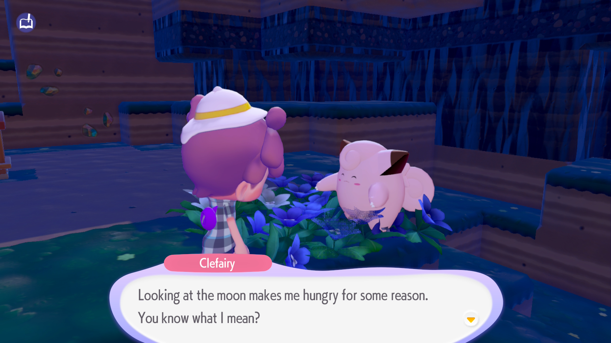
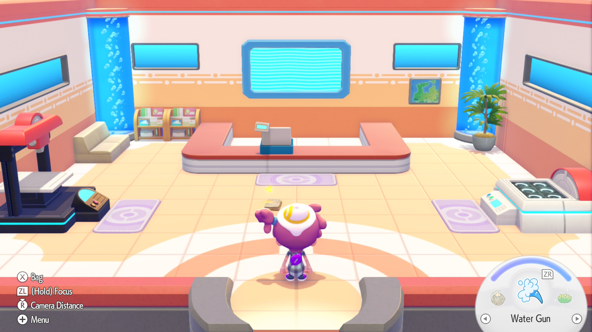
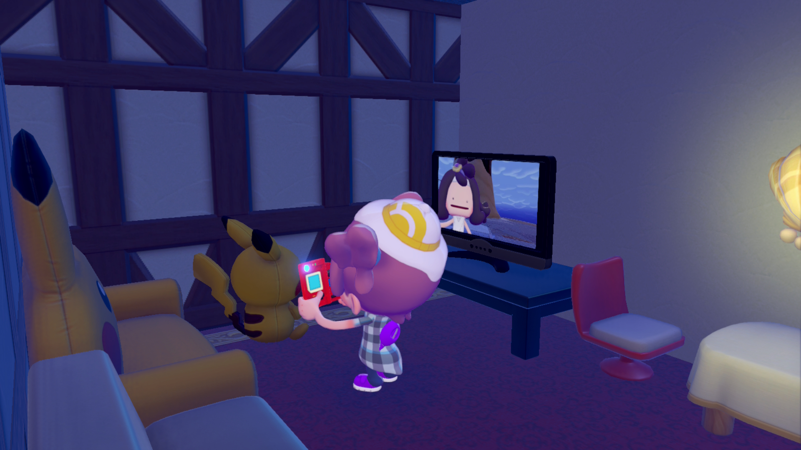

I like Pokémon. I like Minecraft. I like Animal Crossing. I like Dragon Quest Builders.

I **love** Pokopia.

The characters are wonderful, with both the generic Pokémon and the main characters like Professor Tangrowth and Chef Dente being well written and fun. The dynamic interactions between them feels real and fun, and makes the world feel "alive" despite being a wasteland where humans have long since disappeared. I love the dialog, the game mechanics, the sense of discovery as you explore the world... it's all great.

Rebuilding the world is fun, with interesting new takes on traditional Pokémon tropes and mechanics. My ditto, [Nadeshiko](https://yuru-camp.fandom.com/wiki/Nadeshiko_Kagamihara), has been super fun to customize and play with. Currently they wear a plaid shirt and a silly hat. I love how drippy/floppy the dittos look.

[Cloud islands](https://en-americas-support.nintendo.com/app/answers/detail/a_id/71373/~/cloud-island-guide-(pok%C3%A9mon-pokopia)) are really neat. You can create a dedicated online island that you can share the code for, so anyone can view/play there. It works much better than Animal Crossing New Horizon's original multiplayer, since it doesn't require any specific user to be online or "host" the island, and every player can contribute fully to it. It's effectively a complete online private multiplayer server. Super cool!

If you have a Switch 2, you should get Pokopia. If you don't have a Switch 2, Pokopia is a good enough reason to get one.
